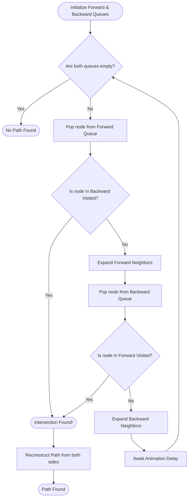

<div align="center">
  
  <h1>🗺️ ROUTEWISE LAB</h1>
  <p><strong>A Flagship Real-World Graph Algorithm Visualization Platform</strong></p>
  
  <p>
    <a href="https://reactjs.org/"></a>
    <a href="https://www.typescriptlang.org/"></a>
    <a href="https://vitejs.dev/"></a>
    <a href="https://tailwindcss.com/"></a>
  </p>
</div>

---

## 📖 The "Why" Behind Routewise Lab

During my 4th-semester Data Structures and Algorithms course, I was fascinated by graph theory. Our professors were incredible at explaining the mechanics of Dijkstra's, A*, and Breadth-First Search on the whiteboard. We learned the math, traced execution steps on paper, and analyzed time complexity (Big O).

However, there was a glaring gap: **While we were taught exactly *how* these algorithms work conceptually, we were never taught how to actually implement them in code for real-world scenarios.**

Learning algorithms via textbooks and exams is vastly different from writing the robust code needed to navigate complex, real-world road networks. I wanted to see these algorithms run in real-time, interactively finding paths across complex topographies. 

**Routewise Lab** was born out of this desire to bridge the gap between theoretical knowledge and practical, visual implementation. This platform brings graph algorithms out of the terminal and onto the screen, allowing users to watch step-by-step as these algorithms explore, learn, and conquer complex routing problems.

---

## 📸 Sneak Peek

*(Add your screenshots/GIFs here before publishing to GitHub!)*

<div align="center">
  
  <p><i>The Main Visualization Dashboard</i></p>
</div>

<br/>

<div align="center">
  
  <p><i>Bidirectional Dijkstra exploring a complex maze in real-time</i></p>
</div>

---

## ✨ Core Features

*   **⚡ Real-Time Visualization:** Watch algorithms explore nodes, evaluate edges, and find the shortest path dynamically.
*   **🛠️ Interactive Graph Building:** Create custom graphs, add obstacles, and define custom start/end points.
*   **🐢 Execution Speed Control:** Slow down the execution to understand the algorithm step-by-step or speed it up for large datasets.
*   **📊 Performance Analytics:** Compare different algorithms based on nodes visited, execution time, and path length.
*   **📱 Responsive UI:** A beautifully crafted, modern user interface built with Tailwind CSS that works seamlessly across devices.

---

## 🧠 Implemented Algorithms

Routewise Lab features a comprehensive suite of pathfinding algorithms, each meticulously implemented in TypeScript to allow for step-by-step event emission and visualization.

### 1. Dijkstra's Algorithm
The classic algorithm for finding the shortest paths between nodes in a graph. It guarantees the shortest path but explores uniformly in all directions, making it slower on large, unobstructed maps.
*   **Heuristic:** None
*   **Guarantees Shortest Path:** Yes
*   **Best For:** Maps without a clear target direction or maps with varying edge weights.

### 2. A* Search (A-Star)
An incredibly efficient and popular algorithm. It uses a heuristic (like Euclidean or Manhattan distance) to guess the direction of the target, allowing it to prioritize exploring nodes that seem closer to the goal.
*   **Heuristic:** Yes (Distance to target)
*   **Guarantees Shortest Path:** Yes (if the heuristic is admissible)
*   **Best For:** Most general pathfinding scenarios where the target location is known.

### 3. Greedy Best-First Search (Greedy BFS)
Similar to A*, but it only considers the heuristic (estimated distance to the goal) and ignores the distance traveled so far. It is very fast but does not guarantee the shortest path.
*   **Heuristic:** Yes
*   **Guarantees Shortest Path:** No
*   **Best For:** Situations where speed is prioritized over getting the absolute optimal path.

### 4. Bidirectional Dijkstra
Runs two simultaneous Dijkstra searches: one forward from the starting node and one backward from the target node. It stops when the two searches meet in the middle.
*   **Heuristic:** None
*   **Guarantees Shortest Path:** Yes
*   **Best For:** Large graphs, as it significantly reduces the search space compared to a standard unidirectional Dijkstra.

### 5. Bidirectional A* Search
The most advanced algorithm in the platform. It combines the targeted approach of A* with the search-space reduction of a bidirectional search.
*   **Heuristic:** Yes
*   **Guarantees Shortest Path:** Yes (with careful termination conditions)
*   **Best For:** Huge, complex maps where performance is critical.

---

## 🏗️ System Architecture & Implementation Process

Implementing algorithms for visualization is fundamentally different from implementing them for pure speed. A standard algorithmic approach uses a simple `while` loop that blocks the main thread until the path is found. 

To visualize the process, I had to architect an **Event-Driven Implementation**.

### The Implementation Problem
If you write a standard `while(queue.length > 0)` loop, React won't update the UI until the loop finishes. You only see the final result, not the process.

### The Solution: Event Emitters & State Management
I refactored every algorithm to act as an asynchronous generator or an event emitter. As the algorithm processes a node or an edge, it emits an event (`NODE_EXPLORED`, `FRONTIER_UPDATED`). The global state manager listens to these events and updates the React UI sequentially, creating the animation effect.

### Architecture Diagram

```mermaid
graph TD
    A[User Interface (React)] -->|Triggers Execution| B(Algorithm Engine)
    B -->|Instantiates| C{Selected Algorithm}
    C -->|Reads| D[(Graph Data Structure)]
    
    C -.->|Event: NODE_VISITED| E[Event Dispatcher]
    C -.->|Event: EDGE_EVALUATED| E
    C -.->|Event: PATH_FOUND| E
    
    E -->|Updates| F[Zustand Global State]
    F -->|Triggers Re-render| A
    
    subgraph Algorithms
    C1[Dijkstra]
    C2[A* Search]
    C3[Bidirectional]
    end
    
    C --- C1
    C --- C2
    C --- C3
```

### Detailed Algorithm Execution Flow (A* Example)

The following diagram illustrates exactly how the A* algorithm has been implemented to allow for visual frame-by-frame updates without blocking the browser.

```mermaid
sequenceDiagram
    participant User
    participant React UI
    participant Event Queue
    participant AStar Instance
    
    User->>React UI: Clicks "Visualize"
    React UI->>AStar Instance: start(startNode, endNode)
    
    loop While Open Set is not empty
        AStar Instance->>AStar Instance: Pop node with lowest f-score
        
        AStar Instance-->>Event Queue: emit(NODE_EXPLORED, currentNode)
        Event Queue-->>React UI: Update Canvas (Color node blue)
        
        opt If currentNode == endNode
            AStar Instance-->>Event Queue: emit(PATH_FOUND, pathArray)
            Event Queue-->>React UI: Draw final path (Color yellow)
            break
        end
        
        loop For each neighbor
            AStar Instance->>AStar Instance: Calculate tentative g-score
            
            opt If tentative g-score < current g-score
                AStar Instance->>AStar Instance: Update scores and set parent
                AStar Instance-->>Event Queue: emit(FRONTIER_UPDATED, neighborNode)
                Event Queue-->>React UI: Update Canvas (Color node green)
            end
        end
        
        AStar Instance->>AStar Instance: await delay(speedMs) 
        Note right of AStar Instance: Pauses execution to allow<br/>React to render the frame
    end
```

### Bidirectional Dijkstra Implementation Flow

Bidirectional search algorithms are complex to implement because you must manage two separate frontiers and ensure the termination condition is correct when the frontiers meet.



---

## 🛠️ Tech Stack & Technologies Used

*   **Frontend Framework:** React 19 (Hooks, Functional Components)
*   **Language:** TypeScript (Strict typing for complex graph data structures)
*   **Build Tool:** Vite (For lightning-fast HMR and optimized builds)
*   **State Management:** Zustand (For lightweight, scalable global state handling)
*   **Styling:** Tailwind CSS (Utility-first CSS for rapid, responsive UI development)
*   **Icons:** Lucide React
*   **Maps/Geospatial:** Leaflet & React-Leaflet (For rendering real-world map tiles)
*   **3D Rendering (Experimental):** Three.js & React Three Fiber
*   **Animations:** Framer Motion (For smooth UI transitions and micro-interactions)

---

## 📁 Project Structure

```text
routewise-lab/
├── public/                 # Static assets (images, logos)
├── src/
│   ├── algorithms/         # Core algorithm implementations
│   │   ├── base/           # Abstract classes and interfaces
│   │   ├── pathfinding/    # Dijkstra, A*, BFS logic
│   │   └── optimization/   # Traveling Salesman, etc.
│   ├── components/         # React Components
│   │   ├── landing/        # Hero sections, feature cards
│   │   ├── visualization/  # The canvas and grid rendering
│   │   └── ui/             # Reusable buttons, modals, sliders
│   ├── store/              # Zustand state slices
│   ├── types/              # Global TypeScript interfaces
│   ├── utils/              # Helper functions (distance calc, etc.)
│   ├── App.tsx             # Main router and layout
│   └── main.tsx            # React DOM entry point
├── package.json            # Dependencies and scripts
├── tailwind.config.js      # Tailwind customization
├── tsconfig.json           # TypeScript configuration
└── vite.config.ts          # Vite bundler settings
```

---

## 🚀 Getting Started (Local Setup)

Want to run this project locally to explore the code or contribute? Follow these steps:

### Prerequisites
Make sure you have [Node.js](https://nodejs.org/) (version 18+ recommended) and `npm` installed on your machine.

### Installation Steps

1. **Clone the repository:**
   ```bash
   git clone https://github.com/yourusername/routewise-lab.git
   ```

2. **Navigate to the project directory:**
   ```bash
   cd routewise-lab
   ```

3. **Install dependencies:**
   Using npm:
   ```bash
   npm install
   ```
   *Or using yarn:*
   ```bash
   yarn install
   ```

4. **Start the development server:**
   ```bash
   npm run dev
   ```
   *The application will now be running on `http://localhost:5173/`*

5. **Build for production (Optional):**
   ```bash
   npm run build
   ```
   *This will generate optimized static files in the `dist` folder.*

---

## 🔮 Future Enhancements

While the core platform is robust, there are several features I plan to implement in the future:
1.  **More Algorithms:** Implementing Minimum Spanning Trees (Kruskal's, Prim's) and Network Flow algorithms.
2.  **Maze Generation:** Adding algorithms like Recursive Backtracker or Cellular Automata to automatically generate complex mazes to solve.
3.  **3D Visualization Mode:** Utilizing the integrated Three.js setup to visualize graph topography with elevation data.
4.  **Custom Weights:** Allowing users to paint different terrain types (mud, water, highway) that dynamically affect edge weights.

---

## 🤝 Contributing

Contributions, issues, and feature requests are highly welcome! Feel free to check the [issues page](https://github.com/yourusername/routewise-lab/issues) if you want to contribute.

1. Fork the Project
2. Create your Feature Branch (`git checkout -b feature/AmazingFeature`)
3. Commit your Changes (`git commit -m 'Add some AmazingFeature'`)
4. Push to the Branch (`git push origin feature/AmazingFeature`)
5. Open a Pull Request

---

## 📜 License

Distributed under the MIT License. See `LICENSE` for more information.

---

<div align="center">
  <p>Built with ❤️ by an algorithm enthusiast bridging the gap between theory and code.</p>
</div>
